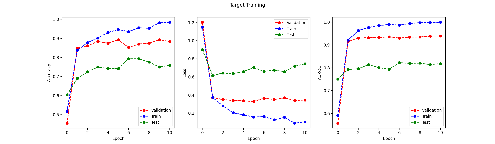
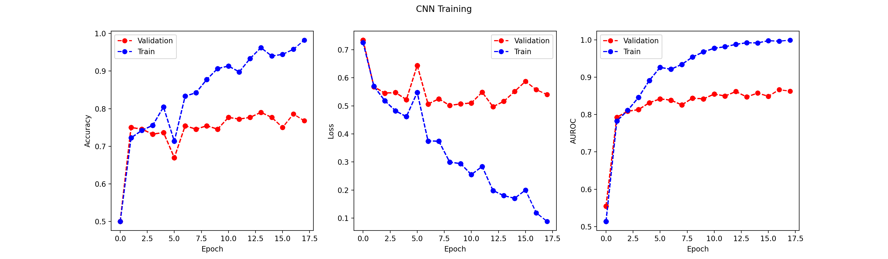

# 1. Data Processing
## (a) i.
The result for each color channel is:
```
Mean: [115.942 115.351 115.663]
Std:  [63.827 66.688 72.982]
```

## (a) ii.
The training set is meant to represent the distribution of data that the model is expected to generalize to. By calculating and applying normalization parameters (mean and standard deviation) from the training set, we ensure that the model learns to generalize well from the specific characteristics of the training data. The main goal is to prevent data leakage, where information from the validation and test sets influences the training process. Using statistics (mean and standard deviation) from the training set ensures that the model is not inadvertently exposed to data it should not have access to during training. This helps in evaluating the model's performance on unseen data more accurately.

## (b)
The first 4 output images are shown below:


# Convolutional Neural Networks
## (a)

### Layer 1: Convolutional Layer 1
- **Filters**: 16
- **Filter Size**: $5 \times 5$
- **Input Channels**: 3
- **Parameters per Filter**: $5 \times 5 \times 3 + 1 = 76$
- **Total Parameters**: $16 \times 76 = 1,216$

### Layer 2: Max Pooling Layer
- **Learnable Parameters**: None

### Layer 3: Convolutional Layer 2
- **Filters**: 64
- **Filter Size**: $5 \times 5$
- **Input Channels**: 16
- **Parameters per Filter**: $5 \times 5 \times 16 + 1 = 401$
- **Total Parameters**: $64 \times 401 = 25,664$

### Layer 4: Max Pooling Layer
- **Learnable Parameters**: None

### Layer 5: Convolutional Layer 3
- **Filters**: 8
- **Filter Size**: $5 \times 5$
- **Input Channels**: 64
- **Parameters per Filter**: $5 \times 5 \times 64 + 1 = 1,601$
- **Total Parameters**: $8 \times 1,601 = 12,808$

### Layer 6: Fully Connected Layer 1 (Output Layer)
- **Input Size**: $32$ (from previous layer's output)
- **Output Size**: 2 (number of classes)
- **Total Parameters**: $32 \times 2 + 2 = 66$

### Total Learnable Parameters
- **Total**: $1,216 + 25,664 + 12,808 + 66 = 39,754$

Thus, the total number of learnable parameters in the described CNN architecture is **39,754**.

## (f)
### i.

### 1. Model Overfitting
It's common to see validation loss decrease as the model starts to learn from the training data, but after a certain point, the model might start to "overfit" to the training data. This means it's learning the details and noise in the training data to an extent that it negatively impacts its performance on the validation data, which the model has not seen before.
### 2. Batch Effect
Since the training uses mini-batch gradient descent, each batch might not be a perfectly representative sample of the dataset. This can cause the updates to swing the model parameters around, leading to fluctuations in validation loss.

### ii.
When patience = 5, the model stopped training at Epoch 11.

When patience = 10, the model stopped training at Epoch 16.

When patience = 5, the model works better. This model is less overfitting compared to patience = 10. Its validation loss is also lower than model with patience = 10. Since model is already overfitting in patience = 5, stop early with less epoch is more efficient. Therefore 5 is better.
Increased patience might be better in scenarios where:
- The validation loss shows significant fluctuations but has a general downward trend over a larger number of epochs.
- The model and the data are complex, and learning the underlying patterns justifiably takes longer, so having a longer patience gives the model more time to learn.
- You have regularization techniques such as dropout applied, which can lead to variability in the loss across epochs.


### iii.
the new input size to the fully connected layer would be 512.

|         | Epoch | **Training AUROC** | **Validation AUROC** |
|---------|-------|--------------------|----------------------|
|8 filters|6      |0.9668|0.9108|
|128 filters|5|0.9913|0.907

When increasing the number of filters from 8 to 128, the model with more filters has a higher training AUROC and a slightly decreased validation AUROC at an earlier epoch (Epoch 5 for 128 filters vs. Epoch 6 for 8 filters). The model with more filters appears to be more overfit to the training data, indicated by a higher training AUROC and a lower training loss. 

Increasing the number of filters increases the model's capacity, allowing it to learn a more complex hierarchy of features. While this can improve the model's ability to fit the training data, it doesn't necessarily mean it will generalize better to unseen data. A larger number of filters in this case lead the model to overfit the training data, as it has more parameters and, therefore, more flexibility to fit the data. This could be a case where the additional capacity provided by more filters is not yet needed for the complexity of the task or the diversity of the data provided.
## (g)
### (i)
| |**Training**|**Validation**|**Testing**|
|--|--|--|--|
|AUROC|0.9668|0.9108|0.67|

### (ii)
Yes. Although the AUROC difference between training and validation is not that significant, the accuracy score gap is relatively large. The training accuracy is 0.9133 while the validation accuracy is 0.8348, which shows evidence of overfitting.

### (iii)
| Metric          | Training | Validation | Testing |
|-----------------|----------|------------|---------|
| Accuracy        | 0.9133   | 0.8348     | 0.6638  |
| Loss            | 0.2854   | 0.3865     | 0.923   |
| AUROC           | 0.9668   | 0.9108     | 0.67    |

### Analysis of Validation vs. Test Performance

When comparing validation and test performance, we observe a significant drop from the validation to the test results. While the validation accuracy is fairly high at 0.8348, the test accuracy falls to 0.6638, and there's a considerable increase in loss from 0.3865 in validation to 0.923 in testing. The AUROC also drops from 0.9108 in validation to 0.67 in testing.

Ideally, the validation and test metrics should be similar, as they both represent the model's performance on unseen data. The discrepancy observed here suggests a few possible reasons:

- **Data Distribution Mismatch**: The validation and test sets might not come from the same distribution. If the validation set is not representative of the kind of data seen in the test set, the model's performance on the test set could be worse.

- **Overfitting**: The model may have overfit to patterns present in the training and, by extension, the validation set, which are not present in the test set. This is supported by the high training accuracy and AUROC, which does not translate to the test performance.

- **Model Robustness**: The model may not be robust to the variability or noise present in the test data, indicating that it has learned specific features of the training data which do not generalize well.

# 3. Visualize what the CNN has learned
## (a)
Given two activation maps $A(1)$ and $A(2)$ and the gradients with respect to a class (label 1) $\frac{\partial y^1}{\partial A^{(1)}}$ and $\frac{\partial y^1}{\partial A^{(2)}}$, we calculate the Grad-CAM output \( L^1 \) as follows:

First, we compute the importance weights \(\alpha_k\) for each activation map:

\[
\alpha_k = \frac{1}{Z} \sum_i \sum_j \frac{\partial y^1}{\partial A^{(k)}_{ij}}
\]

where \(Z = 16\) is the total number of elements in the activation map.

The computed \(\alpha\) values are:

- For \(A(1)\): \(\alpha_1 = \frac{3}{16} \)
- For \(A(2)\): \(\alpha_2 = \frac{7}{16} \)

Using these \(\alpha\) values, we calculate the weighted sum of the activation maps:

\[
L^1 = \text{ReLU} \left( \alpha_1 \cdot A^{(1)} + \alpha_2 \cdot A^{(2)} \right)
\]

The resulting \( L^1 \) matrix is:

\[
L^1 = \begin{bmatrix}
\frac{5}{8} & \frac{5}{8} & \frac{13}{16} & \frac{5}{8} \\
\frac{17}{16} & \frac{5}{4} & \frac{17}{16} & \frac{7}{8} \\
\frac{7}{8} & \frac{17}{16} & \frac{7}{16} & 0 \\
0 & 0 & 0 & 0
\end{bmatrix}
\]

Or in decimal:

\[
L^1 = \begin{bmatrix}
0.625 & 0.625 & 0.8125 & 0.625 \\
1.0625 & 1.25 & 1.0625 & 0.875 \\
0.875 & 1.0625 & 0.4375 & 0 \\
0 & 0 & 0 & 0
\end{bmatrix}
\]

## (b)
Since lighter colors have higher values, from the result pictures we can see that the sky, the white pillars, the windows, people's clothes, and the marble statues tend to have light colors.

## (c)
Yes. From these pictures we can see that there are so significant distibution difference between 2 buildings, where most of the lighter areas lie on sky and human clothes, not their distinguishable architectural features. The Grad-CAM results suggest that the model may be keying in on features that are not directly related to the architectural attributes of the Hofburg Imperial Palace. If these features are more consistently present in the training and validation sets but not in the test set, it could explain the model's poorer performance on the test set. This aligns with the hypothesis of a data distribution mismatch. Also, The reliance on non-distinguishing features indicates that the model might not be robust.

# 4. Transfer Learning & Data Augmentation

## 4.1 Transfer Learning

### (c)

Epoch 16 has the lowest validation lost:
```
Epoch 16
        Validation Accuracy:0.6783
        Validation Loss:0.9982
        Validation AUROC:0.9264
        Train Accuracy:0.85
        Train Loss:0.5214
        Train AUROC:0.9846
```
### (d)

From the plot we can see that for class 3 (Museu Nacional d'Art de Catalunya), the classifier is the most accurate, since it has the darkest color in the confusion matrix, indicating the highest accuracy. On the other hand, for class 0 (Colosseum) the classifier is the least accurate.

Reason: The Museu Nacional d'Art de Catalunya may have very distinct architectural features that are not easily confused with other classes, making it easier for the classifier to identify. For example, its main tower and two small towers. Also, there might be less similarity between the Museu Nacional d'Art de Catalunya and other classes in the dataset, leading to fewer cases of confusion. The Colosseum might share common features with other landmarks, such as similar architectural styles or materials, leading to more misclassifications.


### (f)

<table>
  <tr>
    <th rowspan="2">Freeze Layers</th>
    <th colspan="3">AUROC</th>
  </tr>
  <tr>
    <th>TRAIN</th>
    <th>VAL</th>
    <th>TEST</th>
  </tr>
  <tr>
    <td>Freeze all CONV layers (Fine-tune FC layer)</td>
    <td>0.8984</td>
    <td>0.9101</td>
    <td>0.8219</td>
  </tr>
  <tr>
    <td>Freeze first two CONV layers (Fine-tune last 2 CONV and FC layers)</td>
    <td>0.976</td>
    <td>0.9342</td>
    <td>0.8231</td>
  </tr>
  <tr>
    <td>Freeze first CONV layers (Fine-tune last 2 conv. and fc layers)</td>
    <td>0.99</td>
    <td>0.9357</td>
    <td>0.7937</td>
  </tr>
  <tr>
    <td>Freeze no layers (Fine-tune all layers)</td>
    <td>0.9882</td>
    <td>0.942</td>
    <td>0.7714</td>
  </tr>
  <tr>
    <td>No Pretraining or Transfer Learning (Section 2(g) performance)</td>
    <td>0.9668</td>
    <td>0.9108</td>
    <td>0.67</td>
  </tr>
</table>
The training plots are shown below:

1. Freeze 0 layers


2. Freeze first CONV layer


3. Freeze first two CONV layers


4. Freeze all layers


**Comparing** the test AUROC for the model without pretraining or transfer learning (Section 2(g)) to the models that used transfer learning, we see an overall improvement in test AUROC values when transfer learning is employed. This suggests that the source task is indeed helpful to the target task.

**Hypothesis:** 
- The source and target tasks are similar (all are European landmark architectures), then features learned during the source task might be relevant and reusable for the target task.
-  Also, transfer learning can speed up the training process as the model may not need to learn all features from scratch. 
-  Starting with weights from a model trained on a broader dataset can lead to better generalization on the target task.
  

**The general trend** shown in the table indicates that as more convolutional layers are frozen, the test AUROC tends to increase.

**Reasoning:**
- The earliest layers of a CNN capture basic features that are generally applicable to a wide range of images. Freezing these layers means that these universal features are preserved, which might help the model generalize better to unseen data. 
- By freezing layers, we prevent overfitting to the training data. This is because the model is constrained to only fine-tune the latter layers, which can be seen from the last 2 training plots. Also, from the table we can see that Freeze first two CONV layers has the best test performance. There is a slight decrease in the case where freezing all the layers, which shows that tuning the last layer is helpful to make more accurate predictions on the target tasks.

## 4.2 Data Augmentation

### (b)
<table>
  <tr>
    <th rowspan="2"></th>
    <th colspan="3">AUROC</th>
  </tr>
  <tr>
    <th>TRAIN</th>
    <th>VAL</th>
    <th>TEST</th>
  </tr>
  <tr>
    <td>Rotation (keep original)</td>
    <td>0.9884</td>
    <td>0.8304</td>
    <td>0.6861</td>
  </tr>
  <tr>
    <td>Grayscale (keep original)</td>
    <td>0.9772</td>
    <td>0.9054</td>
    <td>0.7274</td>
  </tr>
  <tr>
    <td>Grayscale (discard original)</td>
    <td>0.9866</td>
    <td>0.8609</td>
    <td>0.8109</td>
  </tr>
  <tr>
    <td>No augmentation (Section 2(g) performance)</td>
    <td>0.9668</td>
    <td>0.9108</td>
    <td>0.67</td>
  </tr>
</table>

Rotation (keep original):


Greyscale (keep original):


Greyscale (discard original):


No augmentation:


### (c)
Based on the training plots and the table, we can see that for the augmented dataset (both rotation and greyscale), the training performances are all higher than no augmentation. For the validation performance, the rotation (keep original) augmentation and the greyscale ones all have lower performance. Also, the greyscale (discard original) model has worse performance than greyscale (keep original) model. However, all of the 3 augmented datasets have better test performance than no augmentation.

Hypothesis:
- Augmentation techniques that preserve the original image characteristics (like rotation) seem to benefit model performance, likely by introducing variations that help the model generalize without losing critical information, also drcreasing the model bias.
- Keeping the original images alongside the augmented ones creates a more diverse and rich dataset, which generally leads to better model performance, especially in validation.
- The drop in validation performance when grayscale and rotated images replace the original ones suggests that color features are important for the classification task. For the greyscale, it loses the color information. For the rotation, it loses some parts of original ones (because we replace them with color black). This might indicate that color provides essential cues that the model relies on for accurate predictions.


# 5. Challenge

## Regularization

To mitigate overfitting, regularization techniques were integral to our model design. Weight decay was set to 1e-4 across all experiments to gently penalize larger weights. Additionally, dropout layers with increasing rates from 0.1 to 0.5 were strategically placed between convolutional layers. This approach aimed to encourage the model to develop more robust features by reducing dependency on any single neuron.

## Feature Selection

Given the model's convolutional nature, feature selection was implicitly managed through the architecture's depth and filter sizes. The convolutional layers were designed to capture a hierarchy of features, from simple edges and textures to more complex patterns relevant to the classification task.

## Model Architecture
Based on the Appendix B&C architecture, I have mande some improvements to enhance the model performance.
- **Batch Normalization**
One of the major enhancements was the incorporation of batch normalization layers following each convolutional layer. Batch normalization standardizes the inputs to the next layer, which has several benefits: It helps mitigate the vanishing gradient problem by maintaining activation scales within a reasonable range throughout the network; Batch normalization introduces a slight noise to the activations, akin to a regularization effect, which can help reduce overfitting.
- **Implementation of Dropout Layers**
Another critical update was the strategic placement of dropout layers with varying dropout rates (0.1, 0.15, and 0.2) after each batch normalization step. Dropout randomly zeroes some of the feature detectors on each forward pass, which prevents the network from becoming too dependent on any single feature. The increasing dropout rates were chosen to impose more regularization deeper in the network.

## Hyperparameters
Hyperparameters were carefully tuned, with a learning rate of 6.5e-4 identified as optimal through a series of experiments focusing on convergence speed and model stability. The batch size was set to 32 to balance between computational efficiency and the model's ability to generalize from mini-batch gradients.

## Model Evaluation
We first choose AUROC as our primary model evaluation criteria due to its effectiveness in assessing binary classification models across various decision thresholds. However, we compare the model result with using validation loss as criteria and find out that validation loss can provide more accurate model. Therefore at last we choose validation loss as our standard, just as previous parts.

## Transfer Learning
As we can see from the Section 4.1, transfer learning can significantly improve the model performance. This approach allowed the model to start with learned features from a broader classification task, enhancing its performance on the binary classification challenge. So in the challenge part, I also create a ```ChallengeSourceModel``` in ```model/challenge_source.py``` as well as the training process ```train_challenge_source.py```. From the result in section 4.1, we can see that freezing 1, 2 or 3 layers have good performances, so we conduct both of them on the target model. At last we find out that freezing only one layer has slightly better performance than freezing 2 layers.

The challenge source training part:

For the best validation loss, we pick Epoch 20.

Freeze 1 layer:

The best test AUROC occurs at Epoch 10, with an AUROC of 0.9328. This is a great improvement compared to the previous ones conducted in Section 4.

Freeze 2 layers:

The best test AUROC occurs at Epoch 16, with an AUROC of 0.929, which is sightly lower than freezing 1 layer, therefore we will use the previous model as prediction.

## Data Augmentation
Learning from section 4.2, we have learnt that data augmentation played a pivotal role in enhancing the model's generalization capability. Of all the possible combination, we choose the one with the best performance with GreyScale and keep the original pictures. The augmentations introduced a diverse range of perspectives and variations, enriching the training data.


s
